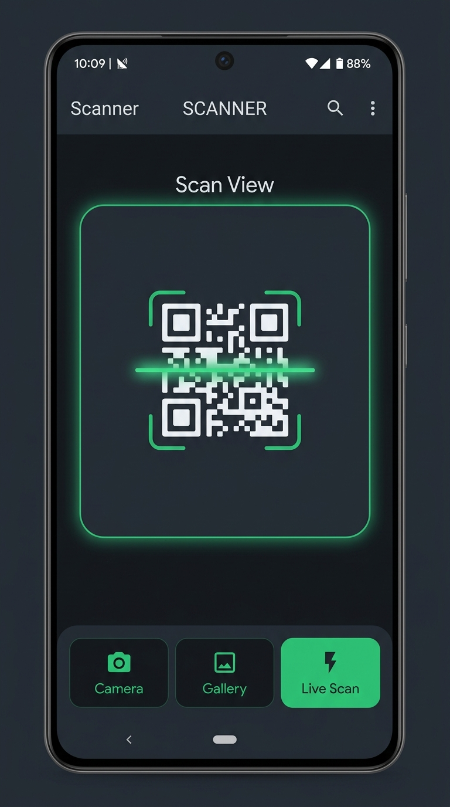
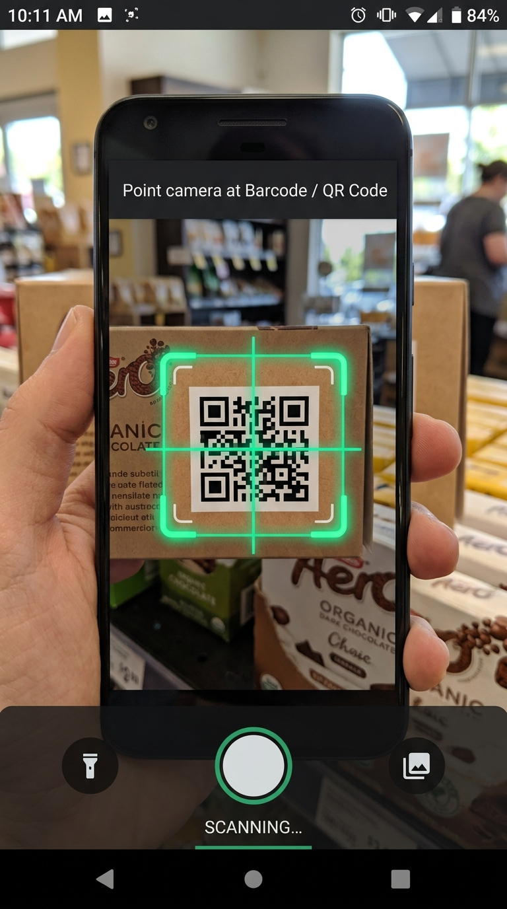
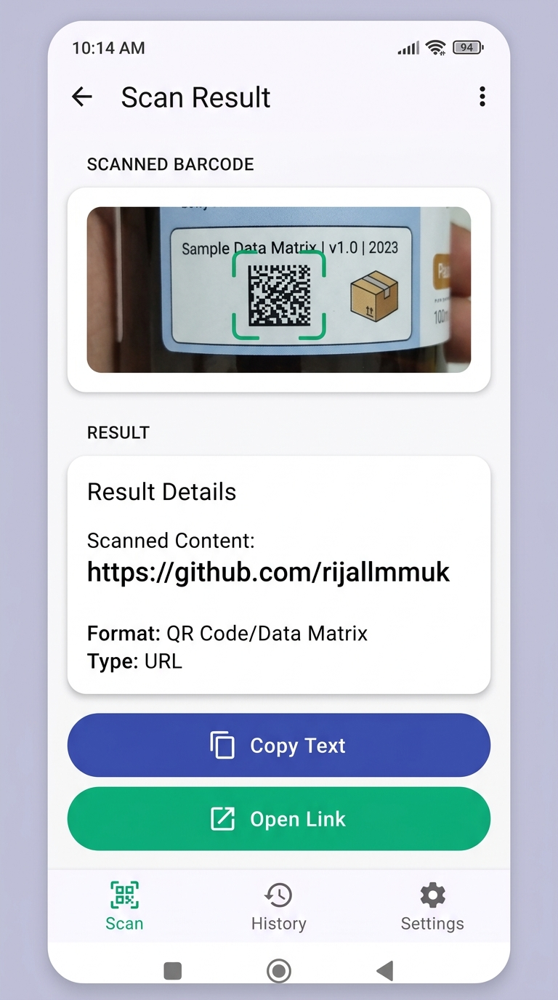

# 📷 Barcode & QR Code Scanner - Android App (Kotlin)

<p align="center">
  
  
  
</p>

Aplikasi Android modern berbasa **Kotlin** untuk pemindaian **Barcode & QR Code** berkecepatan tinggi yang memanfaatkan **CameraX** dan **Google ML Kit Barcode Scanning API**. 

Dilengkapi dengan desain antarmuka berbasis **Material 3 Design System**, deteksi format otomatis, aksi cepat (*smart actions* seperti salin teks & buka tautan), serta dukungan pemindaian *live camera* maupun analisis berkas dari galeri.

---

## 📸 Tampilan Aplikasi (Screenshots)

<table>
  <tr>
    <td width="33%" align="center">
      <strong>Beranda / Input Menu</strong><br/><br/>
      
    </td>
    <td width="33%" align="center">
      <strong>Live CameraX Scanner</strong><br/><br/>
      
    </td>
    <td width="33%" align="center">
      <strong>Hasil Analisis & Actions</strong><br/><br/>
      
    </td>
  </tr>
</table>

---

## 🌟 Fitur Utama

- ⚡ **Live Realtime Scanner (CameraX + ML Kit)**
  - Pemindaian barcode & QR code secara *real-time* langsung melalui kamera dengan *framerate* tinggi dan *viewfinder overlay* interaktif.
- 🖼️ **Analisis Gambar dari Galeri & Kamera**
  - Pilih foto barcode dari Galeri (menggunakan Android *Photo Picker*) atau ambil foto baru untuk dianalisis secara instan.
- 📦 **Dukungan Format Barcode Luas**
  - **1D Barcodes**: EAN-13, EAN-8, UPC-A, UPC-E, Code 39, Code 93, Code 128, ITF, Codabar.
  - **2D Barcodes**: QR Code, Data Matrix, PDF417, AZTEC.
- 🔗 **Aksi Cepat & Pintar (Smart Actions)**
  - **Auto Link Detector**: Otomatis mendeteksi jika hasil barcode berupa tautan URL dan menyediakan tombol langsung untuk membuka browser.
  - **Copy to Clipboard**: Salin hasil barcode ke papan klip hanya dengan satu ketukan.
- 🎨 **Antarmuka Material 3 Modern**
  - Tampilan bersih, responsif, dan elegan dengan Material 3 Card, Slate Header, dan indikator progres.

---

## 🛠️ Teknologi & Library

- **Bahasa Pemrograman**: Kotlin 1.8+
- **Min SDK**: API 24 (Android 7.0 Nougat)
- **Target SDK**: API 34 (Android 14)
- **Camera API**: AndroidX CameraX 1.3.0 (`camera-camera2`, `camera-lifecycle`, `camera-view`)
- **Machine Learning**: Google ML Kit Barcode Scanning 18.3.0 & `camera-mlkit-vision`
- **UI & Architecture**: AndroidX Core KTX, AppCompat, Material Components 1.12.0, ViewBinding, `ActivityResultContracts`

---

## 📁 Struktur Proyek

```
Barcode-Scanner/
├── app/
│   ├── src/main/
│   │   ├── java/com/dicoding/picodiploma/mycamera/
│   │   │   ├── MainActivity.kt        # Halaman utama & pilihan input (Kamera/Galeri/Live)
│   │   │   ├── CameraActivity.kt      # Halaman pemindaian live CameraX & ML Kit
│   │   │   ├── ResultActivity.kt      # Halaman detail & analisis hasil barcode
│   │   │   └── Utils.kt               # Helper utility untuk URI gambar & penyimpanan
│   │   ├── res/
│   │   │   ├── layout/                # Activity layout XML (Material 3)
│   │   │   ├── values/                # Colors, Strings, Themes
│   │   │   └── drawable/              # Custom vector icons & scanner frames
│   │   └── AndroidManifest.xml
│   └── build.gradle.kts               # Modul dependensi gradle
├── screenshots/                       # Tangkapan layar tampilan aplikasi
├── build.gradle.kts                   # Root build script
├── settings.gradle.kts
└── README.md
```

---

## 🚀 Cara Kompilasi & Menjalankan Aplikasi

1. **Clone repository ini:**
   ```bash
   git clone https://github.com/rijallmmuk/Barcode-Scanner.git
   ```

2. **Buka proyek di Android Studio:**
   - Pilih `File` -> `Open...` lalu arahkan ke folder `Barcode-Scanner`.
   - Biarkan Gradle melakukan sinkronisasi dependensi.

3. **Jalankan pada Perangkat / Emulator:**
   - Hubungkan perangkat Android fisik (dengan izin kamera aktif) atau gunakan Android Emulator.
   - Klik tombol **Run 'app'** (`Shift + F10`) pada Android Studio.

---

## 👨‍💻 Pengembang

- **Mukhtarijal** - *Informatika Universitas Negeri Padang*

---
<p align="center">Dibuat dengan ❤️ menggunakan Kotlin & Google ML Kit Vision.</p>
